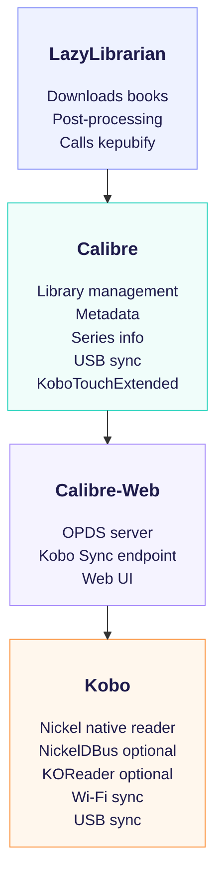

# 🏗️ Architecture Diagram  
This document provides a high‑level architecture diagram of the **LazyLibrarian + Calibre + Calibre‑Web + Kobo** ecosystem.

---

# 📐 System Overview (Text Diagram)

---

# 🔄 Data Flow Summary

### 1. LazyLibrarian → Calibre  
- Books downloaded  
- EPUB → KEPUB conversion  
- Metadata applied  

### 2. Calibre → Calibre‑Web  
- Library exposed via OPDS  
- Kobo Sync endpoint enabled  

### 3. Calibre‑Web → Kobo (Wi‑Fi)  
- Book downloads  
- Metadata sync  
- Shelf sync  
- Reading position sync (with NickelDBus)  

### 4. Calibre ↔ Kobo (USB)  
- Full metadata sync  
- Annotation sync  
- Reading stats sync  
- Thumbnail generation  

---

# 🧠 Optional Components

### NickelDBus  
Adds reading position + annotation sync over Wi‑Fi.

### KOReader  
Adds OPDS browsing + advanced PDF support.

---

# ✔ Summary

This architecture provides:

- Deterministic builds  
- Automatic KEPUB generation  
- Perfect metadata  
- Perfect covers  
- Wi‑Fi + USB sync  
- Optional advanced features
